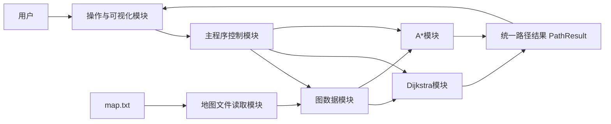
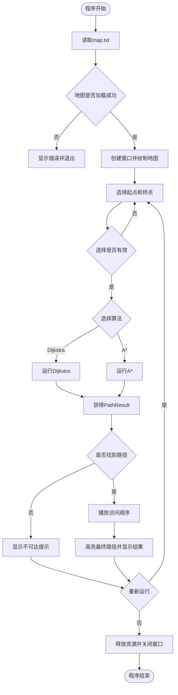
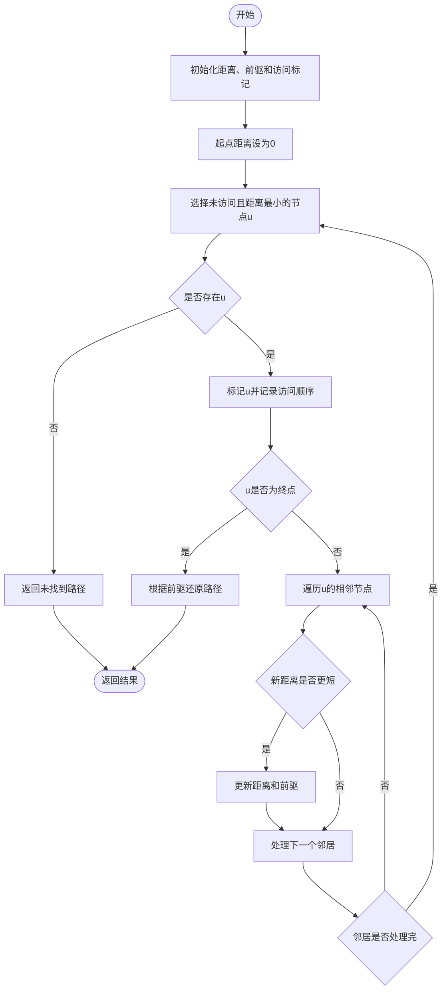
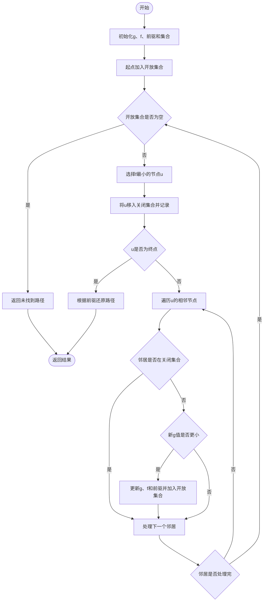

# 地图最短路径可视化系统：项目设计与素材

> 项目语言：C语言

## 1. 项目定位

本项目使用C语言实现一个地图最短路径可视化系统。系统读取预设地图，允许用户选择起点、终点和寻路算法，通过Dijkstra或A*计算最短路径，并动态展示节点搜索过程和最终路线。

项目重点不是模拟真实导航，而是直观展示两种最短路径算法的工作过程及差异。

## 2. 功能清单

### 2.1 必须实现

| 编号 | 功能 | 具体要求 | 完成标志 |
|---|---|---|---|
| F01 | 加载地图 | 从`map.txt`读取节点、坐标、道路和权值 | 界面能够完整显示地图 |
| F02 | 选择起点 | 用户通过下拉框、按钮或点击节点选择起点 | 起点使用绿色标记 |
| F03 | 选择终点 | 用户选择终点，且终点不能与起点重复 | 终点使用红色标记 |
| F04 | 选择算法 | 支持Dijkstra和A*两种算法 | 界面显示当前算法名称 |
| F05 | 执行寻路 | 根据起终点计算最短距离和完整路径 | 输出路径节点序列和总长度 |
| F06 | 搜索可视化 | 按算法访问顺序逐个显示节点 | 已访问节点颜色发生变化 |
| F07 | 路径高亮 | 搜索结束后突出显示最终路径 | 最短路径使用粗线或醒目颜色 |
| F08 | 结果信息 | 显示路径、总长度和访问节点数 | 结果区信息完整 |
| F09 | 速度控制 | 至少提供慢速、正常、快速三档 | 动画速度能够切换 |
| F10 | 重置 | 清除上次结果并允许重新选择 | 地图恢复初始状态 |

### 2.2 有时间再做

- 暂停和继续动画。
- 用户点击地图节点直接选择起终点。
- 显示两种算法的运行时间。
- 在同一界面并排比较两种算法。
- 增加、删除节点和道路。

### 2.3 本期不做

- 真实在线地图和GPS定位。
- 网络请求、账户登录和数据库。
- 交通拥堵、限行、导航语音等真实导航功能。
- 负权道路；Dijkstra和本项目A*均要求道路权值非负。

## 3. 演示地图设计

### 3.1 地图说明

地图以组内确定的《四川大学校园西区图》为主要空间依据，选取16个主要地标，构建32条无向道路。图中左侧为西园宿舍和生活区，中部为江安河、明远湖与长桥，中右部为图书馆和教学区，东门位于右上方，南门位于下方。

本图是用于算法演示的**简化拓扑图**，只保留主要地标和步行关系，坐标及道路权值不是校园实测距离，不可用于真实导航。坐标使用逻辑坐标，图形界面可以按比例放大，例如：

```text
screen_x = offset_x + logical_x * 60
screen_y = offset_y + logical_y * 55
```

道路权值不小于两端节点之间的欧氏距离，因此A*可以使用欧氏距离作为启发函数。

### 3.2 节点表

| 编号 | 文件名称 | 中文含义 | X | Y |
|---:|---|---|---:|---:|
| 0 | SouthwestGate | 西南门 | 2 | 12 |
| 1 | XiyuanDorm | 西园宿舍区 | 2 | 10 |
| 2 | XiyuanCanteen | 西园餐厅 | 3 | 8 |
| 3 | YouthSquare | 青春广场 | 5 | 8 |
| 4 | WestSportsField | 西区运动场 | 5 | 11 |
| 5 | LongBridge | 长桥 | 7 | 8 |
| 6 | KnowledgeSquare | 知识广场 | 9 | 7 |
| 7 | JiangAnLibrary | 江安图书馆 | 9 | 5 |
| 8 | FirstTeachingBuilding | 第一教学楼 | 11 | 5 |
| 9 | ComprehensiveBuilding | 综合楼 | 11 | 7 |
| 10 | AdministrationBuilding | 行政楼 | 10 | 3 |
| 11 | FirstLaboratory | 第一实验楼 | 13 | 4 |
| 12 | JiangAnGym | 江安体育馆 | 14 | 7 |
| 13 | EastGate | 东门 | 15 | 3 |
| 14 | SouthGate | 南门 | 10 | 11 |
| 15 | MingyuanLake | 明远湖观景点 | 7 | 6 |

### 3.3 道路表

所有道路均为双向道路。

| 道路 | 起点 | 终点 | 长度 |
|---:|---|---|---:|
| 1 | 西南门 | 西园宿舍区 | 2.0 |
| 2 | 西南门 | 西区运动场 | 3.2 |
| 3 | 西南门 | 南门 | 8.1 |
| 4 | 西园宿舍区 | 西园餐厅 | 2.3 |
| 5 | 西园宿舍区 | 青春广场 | 3.7 |
| 6 | 西园宿舍区 | 西区运动场 | 3.2 |
| 7 | 西园餐厅 | 青春广场 | 2.0 |
| 8 | 青春广场 | 西区运动场 | 3.7 |
| 9 | 青春广场 | 长桥 | 2.0 |
| 10 | 青春广场 | 明远湖观景点 | 2.9 |
| 11 | 西区运动场 | 南门 | 5.0 |
| 12 | 长桥 | 知识广场 | 2.3 |
| 13 | 长桥 | 明远湖观景点 | 2.0 |
| 14 | 知识广场 | 江安图书馆 | 2.0 |
| 15 | 知识广场 | 综合楼 | 2.0 |
| 16 | 知识广场 | 明远湖观景点 | 2.3 |
| 17 | 江安图书馆 | 第一教学楼 | 2.0 |
| 18 | 江安图书馆 | 行政楼 | 2.3 |
| 19 | 江安图书馆 | 明远湖观景点 | 2.3 |
| 20 | 第一教学楼 | 综合楼 | 2.0 |
| 21 | 第一教学楼 | 行政楼 | 2.3 |
| 22 | 第一教学楼 | 第一实验楼 | 2.3 |
| 23 | 综合楼 | 第一实验楼 | 2.9 |
| 24 | 综合楼 | 江安体育馆 | 3.0 |
| 25 | 综合楼 | 南门 | 4.2 |
| 26 | 行政楼 | 第一实验楼 | 3.2 |
| 27 | 行政楼 | 东门 | 5.0 |
| 28 | 第一实验楼 | 江安体育馆 | 3.2 |
| 29 | 第一实验楼 | 东门 | 2.3 |
| 30 | 江安体育馆 | 东门 | 4.2 |
| 31 | 江安体育馆 | 南门 | 4.5 |
| 32 | 西园餐厅 | 明远湖观景点 | 4.5 |

### 3.4 地图关系草图

```text
西南门(0)----西园宿舍(1)----西园餐厅(2)
    \             |               \
     \       西区运动场(4)----青春广场(3)----长桥(5)
      \             \                            \
       +-------------南门(14)       明远湖(15)---知识广场(6)
                                            \      /      \
                                         图书馆(7)      综合楼(9)
                                          /    \          /    \
                                   行政楼(10) 第一教学楼(8)  体育馆(12)
                                          \        \       /      /
                                           第一实验楼(11)----东门(13)
```

## 4. 地图文件格式

### 4.1 格式约定

```text
NODES 节点数量
节点编号 英文名称 X坐标 Y坐标
...
EDGES 道路数量
起点编号 终点编号 道路长度
...
```

约定：

- 节点编号从0开始，且不能重复。
- 英文名称不包含空格，避免C语言读取时额外处理。
- 道路为无向道路，文件中每条道路只写一次。
- 道路长度必须大于0。
- 程序加载道路时同时建立`from -> to`和`to -> from`关系。

完整初始数据见：[map.txt](data/map.txt)。

## 5. 系统模块图



### 模块职责

| 模块 | 主要职责 |
|---|---|
| 主程序 | 控制程序流程，接收用户选择并调用算法 |
| 图数据 | 保存节点、道路和邻接关系 |
| 文件读取 | 从`map.txt`加载地图数据 |
| Dijkstra | 计算最短路径并记录访问顺序 |
| A* | 使用启发函数计算最短路径并记录访问顺序 |
| 路径结果 | 统一保存路径、距离和访问顺序 |
| 可视化 | 绘制地图、播放搜索过程、显示最终路线 |

## 6. 程序总体流程



## 7. Dijkstra算法方案

### 7.1 输入与输出

输入：图、起点编号、终点编号。  
输出：是否找到路径、最短距离、完整路径、访问节点顺序。

### 7.2 算法步骤

1. 所有节点距离初始化为无穷大，前驱初始化为`-1`。
2. 起点距离设为0。
3. 从未访问节点中选择当前距离最小的节点`u`。
4. 将`u`标记为已访问，并记录到访问顺序。
5. 若`u`是终点，则结束搜索。
6. 遍历`u`的所有相邻节点，尝试更新其距离和前驱。
7. 重复步骤3至6，直到找到终点或没有可访问节点。
8. 从终点沿前驱数组反向回溯，再将路径翻转。

### 7.3 流程图



## 8. A*算法方案

### 8.1 启发函数

使用当前节点到终点的欧氏距离：

```text
h(n) = sqrt((x_n - x_goal)^2 + (y_n - y_goal)^2)
f(n) = g(n) + h(n)
```

其中：

- `g(n)`是起点到节点`n`的实际路径长度。
- `h(n)`是节点`n`到终点的估计距离。
- `f(n)`是A*选择节点时使用的估计总代价。

本地图每条道路的权值均不小于两节点之间的欧氏距离，因此该启发函数不会高估剩余路径长度。

### 8.2 算法步骤

1. 所有节点的`g`和`f`初始化为无穷大。
2. 起点`g=0`，`f=h(起点)`，并加入开放集合。
3. 从开放集合选择`f`最小的节点`u`。
4. 将`u`移入关闭集合，并记录访问顺序。
5. 若`u`是终点，则根据前驱还原路径。
6. 遍历`u`的相邻节点，计算经过`u`到达邻居的新`g`值。
7. 若新路径更短，则更新邻居的`g`、`f`和前驱，并加入开放集合。
8. 重复步骤3至7，直到找到终点或开放集合为空。

### 8.3 流程图



## 9. 界面草图

建议窗口尺寸为`1000 x 700`，左侧显示地图，右侧放置控制和结果信息。

```text
┌──────────────────────────────────────────────────────────────┐
│ 地图最短路径可视化系统                                       │
├────────────────────────────────────────┬─────────────────────┤
│                                        │ 起点：[西园宿舍  ▼] │
│                                        │ 终点：[东门      ▼] │
│                                        │                     │
│              地图绘制区域              │ 算法：              │
│                                        │ (●) Dijkstra        │
│   ○────○────○────○                    │ ( ) A*              │
│   │   ╱│   ╱│   ╱                     │                     │
│   ○────○────○                          │ 速度：[正常      ▼] │
│   │    │╲   │╲                         │                     │
│   ○────○────○────○                    │ [开始] [暂停]       │
│          ╲   ╱      ╱                  │ [重置] [退出]       │
│             ○                          │                     │
│                                        │ 结果：              │
│                                        │ 距离：15.2          │
│                                        │ 访问节点：待程序计算│
│                                        │ 路径：1-3-5-6-9-11-13│
├────────────────────────────────────────┴─────────────────────┤
│ 图例：绿色=起点 红色=终点 蓝色=访问节点 黄色=最终路径         │
└──────────────────────────────────────────────────────────────┘
```

### 配色建议

| 对象 | 建议颜色 |
|---|---|
| 普通节点 | 白色填充、深灰边框 |
| 普通道路 | 浅灰色 |
| 起点 | 绿色 |
| 终点 | 红色 |
| 当前节点 | 橙色 |
| 已访问节点 | 蓝色 |
| 最终路径 | 黄色粗线或亮绿色粗线 |
| 背景 | 浅灰白色 |

## 10. 演示路线

### 路线一：西园宿舍区到东门

- 起点：西园宿舍区（1）
- 终点：东门（13）
- 预期最短路径：`1 -> 3 -> 5 -> 6 -> 9 -> 11 -> 13`
- 预期长度：`3.7 + 2.0 + 2.3 + 2.0 + 2.9 + 2.3 = 15.2`
- 演示目的：同时运行Dijkstra和A*，比较访问节点数量。

### 路线二：西园宿舍区到第一实验楼

- 起点：西园宿舍区（2）
- 终点：第一实验楼（11）
- 一条预期最短路径：`1 -> 3 -> 5 -> 6 -> 9 -> 11`
- 预期长度：`3.7 + 2.0 + 2.3 + 2.0 + 2.9 = 12.9`
- 演示目的：从生活区经过长桥进入教学区，路线具有江安校区辨识度。

### 路线三：西区运动场到行政楼

- 起点：西区运动场（4）
- 终点：行政楼（10）
- 预期最短路径：`4 -> 3 -> 5 -> 6 -> 7 -> 10`
- 预期长度：`3.7 + 2.0 + 2.3 + 2.0 + 2.3 = 12.3`
- 演示目的：展示从运动生活区域跨越长桥到行政教学区域的路径。

> 最终演示前，成员B应使用程序结果复核路线和距离。若存在等长最短路径，程序输出其中任意一条均可。

## 11. 交接清单

### 交给成员B

- 功能清单和范围。
- 节点表、道路表及`map.txt`。
- Dijkstra和A*算法步骤。
- 界面草图和配色说明。
- 三组演示路线。

### 交给成员C

- 项目定位和功能清单。
- 地图设计与文件格式说明。
- 系统模块图和总体流程图。
- 两种算法的步骤与流程图。

### 交给成员D

- 系统模块图和算法流程图。
- 地图关系草图和界面草图。
- 配色方案及演示路线。
- 后续由成员B补充的程序截图和算法对比数据。

## 12. 需要全组确认的问题

1. 老师是否批准“地图最短路径可视化系统”这一自拟题目？
2. 允许使用哪一个C语言图形库？
3. 界面采用鼠标选择还是下拉框/键盘输入？
4. 地图是否只读，还是需要支持用户修改节点和道路？
5. 是否必须展示搜索动画，还是只显示最终路径即可？
6. 是否要求保存算法运行记录？
7. 最终演示时间和PPT页数是否有限制？

以上问题确认后，成员A更新本文件并通知其他三人。

## 13. 地图设计依据

- [四川大学党政办公室：江安校区地图](https://dzb.scu.edu.cn/info/1025/1012.htm)
- [四川大学关于江安校区楼宇、景观和道路正式命名的公告](https://xcb.scu.edu.cn/info/1008/1353.htm)
- [四川大学网络空间安全学院：江安校区游园介绍](https://ccs.scu.edu.cn/info/1025/4236.htm)
- [四川大学匹兹堡学院：江安校区设施及食宿介绍](https://scupi.scu.edu.cn/%E6%A0%A1%E5%9B%AD%E7%94%9F%E6%B4%BB/%E5%AD%A6%E9%99%A2%E8%AE%BE%E6%96%BD)

地标名称采用学校公开资料中的名称；节点坐标、连边和道路权值是为算法演示设计的简化数据，不代表真实测绘结果。
